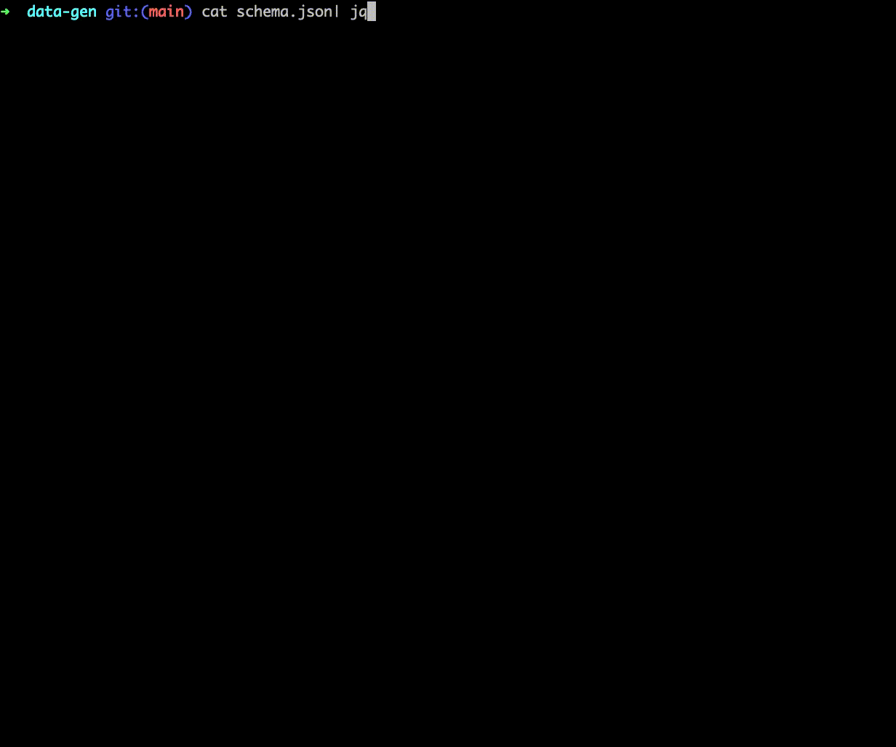

DataGen
======

CLI and library for generating realistic looking, fake JSON data. 

# CLI

The CLI utility `data-gen` creates realistic looking, fake JSON data based on a given input schema. 
The output can be generated once, or continuously, and is written to `stdout` to be piped into other processes. 



## Schema

Data schema's are defined via a JSON format which declares field names and types. 
Types are semantic, and intended to look more naturalistic than simple random numbers or strings. 

```javascript
{
  "id": { "type": "range", "from": 1, "to": 10 }
}
```

The above schema will then generate JSON objects with a field `id` whose value is a random number in the range 1 to 10. 
You can find an example of a more complex schema [here](schema.json).

### Types

#### Array 

A homogenous fixed sized collection of a specified type.

##### Parameters

- `element`: The subtype of each element.
- `size`: The size of the array.

##### Example

```javascript
{ "type": "array", "element": { "type": "range", "from": 1, "to": 10 }, size: 3 }
```

#### Boolean

Generates a random boolean value.

##### Parameters

None

##### Example

```javascript
{ "type": "boolean" }
```

#### Generator

A generator creates string values based on a format string. 
This string can interpolate in values from predefined datasets. 
Interpolations are defined within the `#{}` tag. 

##### Parameters

- `format`: The format specifier with 0 or more interpolator patterns

##### Example

```javascript
{ "type": "generator", "format": "#{ancient.hero} is my favorite ancient hero!" } 
```

##### Available Data Sets

- `address.city_prefix`: Common city prefix names.
- `address.city_suffix`: Common city suffix names.
- `ancient.hero`: Ancient greek heros.
- `ancient.god`: Ancient greek gods.
- `ancient.primordial`: Ancient greek primordial beings.
- `ancient.titan`: Ancient greek titans.

#### Literal

A literal type which always returns a static value.

##### Parameters

- `value`: The static value for the field.

##### Example

```javascript
{ "type": "literal", "value": "hello world!" }
```

#### Object

A nested structured type comprised of heterogenous named fields.

#### Parameters

- `fields`: A map of field names to field types.

#### Example

```javascript
{ "type": "object", "fields": { "inner": { "type": "literal", value: "i'm inside!" }}}
```

#### One Of

An enumeration type that returns one of a fixed set of values.

##### Parameters

- `options`: The list of options.

##### Example

```javascript
{ "type": "one_of", "options": ["coffee", "milk", "tea"] }
```

#### Phone Number

A realistic looking phone number of the format `XXX-XXX-XXXX`. 

##### Parameters

None

##### Example

```javascript
{ "type": "phone_number" }
```

#### Range

A random number from a given range. 

##### Parameters

- `from`: The lower bound of the range.
- `to`: The upper bound of the range.

##### Example

```javascript
{ "type": "range", "from": 1, "to": 10 }
```

#### Regex

A random value that matches the specified regular expression. Note, escape characters need to be doubly escaped for proper deserialization. 

##### Parameters

- `pattern`: The regular expression all values must match

##### Example

```javascript
{ "type": "regex", "pattern": "http[s]{0,1}://www\\.(amazon|twitter)\\.(com|org)" }
```

#### Timestamp

A timestamp formatted string. 
Unlike other data types, timestamps always return the current time.
For most demo scenarios, it makes sense for timestamps to be monotinically increasing. 
If you want truley random timestamps, this can be simulated via the `regex` type. 

##### Parameters

None

##### Example

```javascript
{ "type": "timestamp" }
```

## Data Gen Lib

The underlying library is also available for use in other rust programs. 
The mid-term goal is to allow generating random values of any `struct` via a derive macro.
It is currently possible to wire this functionality up today by hand, but doing so is `unsafe` and will cause
runtime panics if the schema does not perfectly match the destination type.
